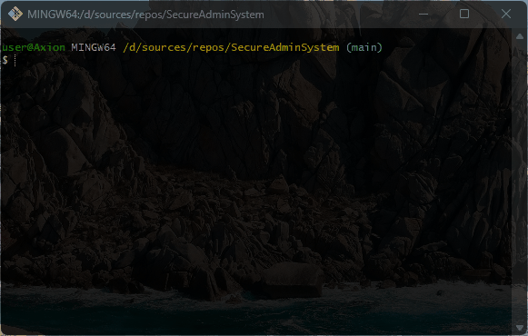
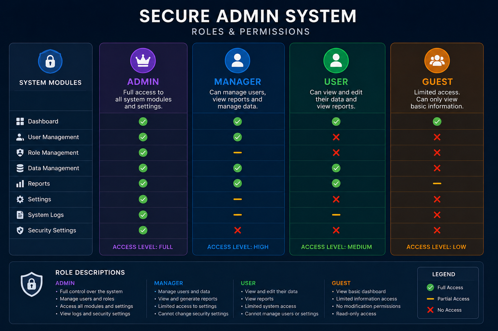

# 🪪 SecureAdminSystem
admin-managed user system

### 💻 About Program
*The program provides a system that allows multiple roles to be managed by the admin.*

## 🪟 Preview                                  

### ⚙️ Technologies
 

## 🧑‍💻 I worked on it
- *Data types*
- *Console class*
- *Selection statements (if else)*
- *Counter loops (for)*
- *User created methods*

### 🤝 Future development
- *Create admin panel menu*
- *Add a menu for users to work with and edit their information through the admin (by collections or files)*                         

- *Add other (manager, guest) roles*